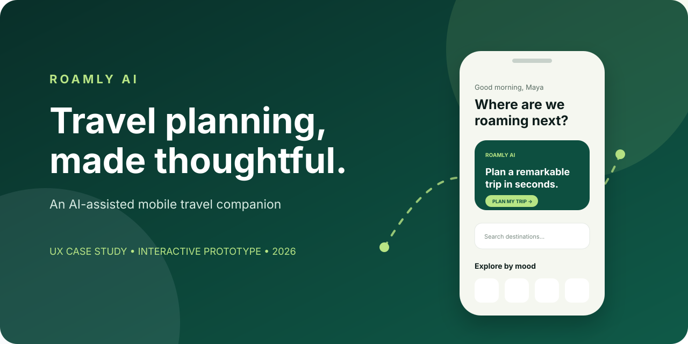
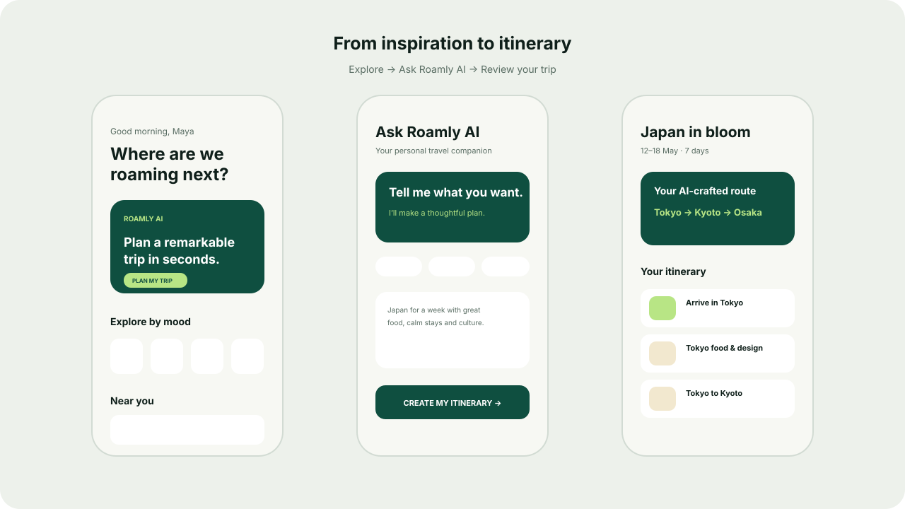

<div align="center">



# Roamly AI

**A thoughtful AI-assisted travel companion for discovering places and shaping memorable trips.**

[](https://vinay-712.github.io/roamly-ai/)
[](https://github.com/vinay-712/roamly-ai/actions/workflows/quality.yml)
[](LICENSE)
[](CHANGELOG.md)

[View live prototype](https://vinay-712.github.io/roamly-ai/) · [Read the UX case study](CASE_STUDY.md) · [Report an issue](https://github.com/vinay-712/roamly-ai/issues/new/choose)

</div>

## Overview

Roamly AI explores how conversational AI can make travel planning feel less fragmented. The mobile-first prototype connects destination discovery, natural-language planning, itinerary review, saved places, and traveller preferences in one calm experience.

> **Try it now:** [Open the interactive prototype →](https://vinay-712.github.io/roamly-ai/)

## Why this project matters

Travellers often jump among inspiration apps, maps, notes, search results, and booking tools. Roamly AI presents a more coherent path from early inspiration to a useful trip outline while keeping the traveller in control.

This project demonstrates product thinking, UI/UX design, responsive frontend implementation, accessibility considerations, and AI-assisted interaction design.

## Experience highlights

- **Destination discovery** through nearby recommendations and travel moods
- **Conversational trip planning** with free-form and starter prompts
- **Destination evaluation** with concise highlights and clear next actions
- **Readable itineraries** organized by route and day
- **Persistent saved places** stored locally in the browser
- **Responsive presentation** for mobile and desktop
- **Accessible feedback** with keyboard focus, live status messages, and reduced-motion support

## Product journey



| Step | Screen | User outcome |
| --- | --- | --- |
| 01 | Explore | Find inspiration or begin planning |
| 02 | Ask Roamly AI | Describe the desired trip |
| 03 | Destination details | Evaluate a destination |
| 04 | My trip | Understand the generated route |
| 05 | Saved places | Return to travel ideas |
| 06 | Profile | Review traveller preferences |

For the design rationale, target users, accessibility decisions, and next research questions, read the **[complete UX case study](CASE_STUDY.md)**.

## Try the prototype

The experience is published with GitHub Pages—no installation or account is required.

**[Launch Roamly AI →](https://vinay-712.github.io/roamly-ai/)**

Suggested walkthrough:

1. Select **Plan my trip**.
2. Choose a starter prompt or write your own.
3. Create the sample itinerary.
4. Open Kyoto and save it.
5. Explore Trips, Saved, and Profile from the navigation.

## Technology

- Semantic HTML5
- Modern responsive CSS
- Vanilla JavaScript
- Browser local storage
- GitHub Pages
- GitHub Actions

No framework, package installation, or build step is required.

## Run locally

```bash
git clone https://github.com/vinay-712/roamly-ai.git
cd roamly-ai
python -m http.server 4173
```

Open `http://localhost:4173`.

## Project structure

```text
roamly-ai/
├── .github/             # Quality workflow and issue templates
├── assets/              # Repository presentation artwork
├── scripts/             # Dependency-free quality checks
├── index.html           # Application shell and social metadata
├── styles.css           # Responsive UI and design tokens
├── app.js               # Screens, state, navigation, interactions
├── CASE_STUDY.md        # UX process and design rationale
├── CHANGELOG.md         # Version history
├── CONTRIBUTING.md      # Contribution workflow
├── CODE_OF_CONDUCT.md   # Community standards
├── SECURITY.md          # Responsible reporting
└── LICENSE              # MIT license
```

## Quality

Every push and pull request checks JavaScript syntax and key repository requirements through GitHub Actions. The prototype also supports visible keyboard focus, reduced motion, responsive layouts, and accessible status feedback.

## Current scope

This is a portfolio-ready **frontend prototype**, not a production travel service. Destination data and itinerary generation are simulated. It does not process bookings, payments, real accounts, or live personal travel data.

## Roadmap

- [ ] Connect a secure AI itinerary service
- [ ] Add live destination search and map data
- [ ] Make itinerary days editable and reorderable
- [ ] Add authentication and cloud persistence
- [ ] Add usability test findings
- [ ] Add end-to-end browser tests

## Contributing

Thoughtful feedback and improvements are welcome. Please read [CONTRIBUTING.md](CONTRIBUTING.md) and use the repository’s issue templates.

## Author

**Vinay Chandra (Trilok)**  
UI/UX Designer · Working with AI · Hyderabad, India

[LinkedIn](https://www.linkedin.com/in/vinay-chandra-trilok-a8b99b261/) · [GitHub](https://github.com/vinay-712)

## License

Released under the [MIT License](LICENSE).
